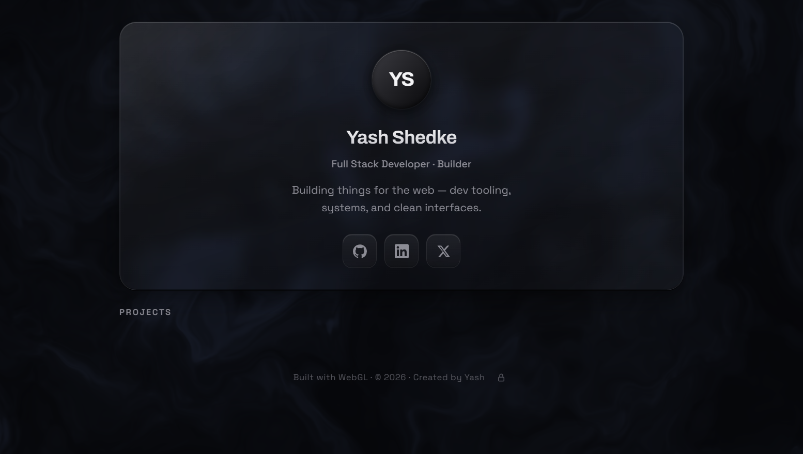

# Yash — Projects Landing Page & Admin Console

A premium, high-aesthetic landing page and project showcase. It features a real-time WebGL liquid-sheen background, a glassmorphic dashboard interface, and an admin editor to update projects and profile details on the fly.

![Aesthetic Preview]

You can see the dashboard live at: https://ys-landing.vercel.app/
---

## ✨ Features

- **Aesthetic UI/UX**: Designed with deep charcoal backdrops, liquid-glass cards, sleek typography (Archivo + Space Grotesk), smooth micro-animations, and responsive grids.
- **WebGL Background**: Powered by a custom WebGL shader program rendering a responsive, interactive, linen-textured slate-charcoal flow.
- **Admin Console (`/admin.html`)**: An integrated editor where you can customize:
  - Initials, Name, Role, Bio.
  - Profile Image (via local image upload converted to data URL, or direct URL).
  - Social Links (GitHub, LinkedIn, Twitter/X).
  - Project Cards (add, delete, reorder, and toggle full-width vs. half-width layouts).
- **Persistent Data**: Changes made in the Admin Console are persisted in browser `localStorage` for immediate live updates.
- **Secure Access**: The Admin Console is protected by a hashed secret configuration.

---

## 🛠️ Tech Stack

- **Core**: HTML5, Vanilla JavaScript, CSS3
- **Graphics**: WebGL (fragment shaders)
- **Local Server**: Node.js (`http` & `fs` modules, zero external dependencies)
- **Deployment**: Vercel Serverless Functions

---

## 🚀 Getting Started

### Local Development

1. **Clone the repository**:
   ```bash
   git clone https://github.com/Yash21116/-----manylinks.git
   cd Landing page
   ```

2. **Configure your environment**:
   Create a `.env` file at the root:
   ```bash
   ADMIN_PASSWORD=your_memorable_secret
   ```
   (The server hashes this internally — never store a pre-hashed value)

3. **Start the local server**:
   ```bash
   node server.js
   ```
   Open:
   - Live Page: [http://localhost:3333](http://localhost:3333)
   - Admin Console: [http://localhost:3333/admin.html](http://localhost:3333/admin.html)

### Production Deployment (Vercel)

1. Deploy the directory using Vercel.
2. In your **Vercel Project Dashboard**, navigate to **Settings** → **Environment Variables**.
3. Add the following environment variable:
   - **Key**: `ADMIN_PASSWORD`
   - **Value**: `your_memorable_secret`
   (The serverless function `/api/verify-admin` will hash this server-side for verification)
4. Redeploy the application.

**Security Note**: Vercel automatically serves all deployments over **HTTPS**, which encrypts your admin password in transit. The server-side password verification prevents the hash from ever being exposed to the browser.

---

## 🔑 Security & Configuration

### Admin Authentication

The admin console uses **server-side password verification** to protect against browser-based attacks:

- **Password Hashing**: The password is hashed using SHA-256 on the server (never exposed to the browser)
- **Server Verification**: The `/api/verify-admin` endpoint compares hashes server-side only
- **HTTPS Encryption** (Production): All passwords in transit are encrypted by HTTPS
  - ✓ Local development (HTTP): Safe because there's no network to sniff
  - ✓ Vercel production (HTTPS): Passwords are encrypted in transit + verified server-side

### Environment Variables

- **Local**: Set `ADMIN_PASSWORD` in `.env` (untracked by Git for security)
- **Vercel**: Set `ADMIN_PASSWORD` in Project Settings → Environment Variables

Never commit `.env` or `config.js` to version control.
